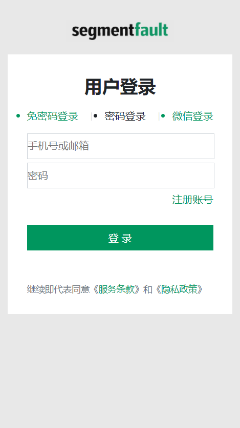

# 项目名称：cPro

## 团队与分工

> 项目负责人：练利华，项目核心人物：陈伟豪、郑永忠

* 练利华
    * 全局公共代码的维护
    * 后台管理系统的搭建
    * 后台管理登录验证模块搭建
    * 后台管理系统首页可视化图形实现
    * 后台管理系统用户管理模块图形实现
    * 后台管理系统轮播图管理模块实现
    * 移动端登录注册的实现
    * 参与项目上线部署

* 陈伟豪  
    * 负责后端服务器搭建
    * 负责后端接口开发实现
    * 负责后端图片接收处理
    * 负责数据库的搭建
    * 后台管理系统文章管理模块的实现
    * 后台管理系统问答管理模块的实现
    * 项目上线部署

* 郑永忠
    * 移动端基础布局实现
    * 移动端首页文章模块的实现
    * 移动端问答模块的实现
    * 移动端技术频道模块的实现

## 演示
* 官网：
* 上线网址：https://segmentfault.com/
    * webapp：http://39.101.197.115:3000
    * 后台管理系统：http://39.101.197.115
* git仓库地址：https://github.com/gzh51915/cPro
    * webapp：https://github.com/gzh51915/cPro/tree/develop/cpro
    * 后台管理系统：https://github.com/gzh51915/cPro/tree/develop/cms

## 项目目录说明

### cms 后台管理系统

* public 服务器根目录
* src 源码
    * api axios的二次封装
    * components 组件文件
    * routers 路由懒加载
    * store redux数据
    * utils 工具包
    * view 页面

### cPro 移动端App

* public 服务器根目录
* src 源码
    * api axios的二次封装
    * components 组件文件
    * assets 静态资源

### SF-admin-server

* modules 模型创建文件
* routers 接口文件
* utils 公共包
* server.js 入口文件 

## 项目页面截图

### cms 后台管理系统

### cpro 移动端app

